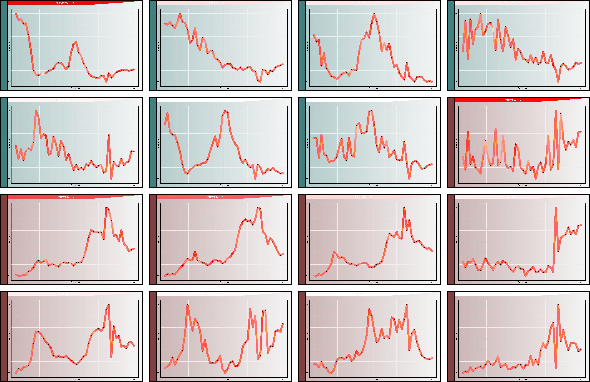

# TSViz: Demystification of Deep Learning Models for Time-Series Analysis

This repository contains the code for the paper "**TSViz: Demystification of Deep Learning Models for Time-Series Analysis**".

## Plots

The plots in the paper were generated using the createTSVizPlots.py script present in the repository.
The user has to manually configure the layer and the input example to plot. 
These parameters are present in the main method of the script. Two sample plots from the script are visualized below.

<!-- {:width="50px"} -->



## Core

### Deployment

To directly start the service, use the following command:

```
python3 ./Service/visualizationService.py
```

The system is also available with Docker deployment file. In order to deploy the service as docker container, just execute the docker build command, and then start the container. 
For convenience, we have provided sample docker deployment and start files. 
```
./docker_build.sh
./docker_start.sh
```

### Using the API

To set the iterator to one particular example, use the following exposed method:
```
http://localhost:5000/viz/api/set?iterator=2
```
In this example, the iterator is set to the second index i.e. third example since Python is zero-indexed.
To fetch data from the API, use the following exposed method:
```
http://localhost:5000/viz/api/fetch
```
This will return the raw data. Since the data contains a lot of information, it might not be always be required to consume all the available information.

The following Python snippet fetches data from the service and decodes into Python compatible list.
```
import requests
import json

# Fetch the example number 2
exampleIdx = 2
response = requests.get("http://localhost:5000/viz/api/set?iterator=" + str(exampleIdx))  # Reset the iterator to the first example
print("Example ID set response:", response.status_code)

# Fetch the data
response = requests.get("http://localhost:5000/viz/api/fetch")
print("Example fetch response:", response.status_code)
if response.status_code != 200:
    print("Error: Unable to retrieve data from service!")
    exit(-1)

data = json.loads(response.content.decode("utf-8"))["data"]
```

The following Python snippet iterates over the entire dataset.
```
import requests
import json

url = "http://pc-4133:5000/viz/api/"

# Switch to the test set (automatically resets the iterator)
response = requests.get(url + "test")
if response.status_code != 200:
    print("Error: Unable to switch to the test set!")
    exit(-1)

while True:
    # Fetch the data
    response = requests.get(url + "fetch")
    print("Example fetch response:", response.status_code)
    if response.status_code != 200:
        print("Error: Unable to retrieve data from service!")
        exit(-1)
    data = json.loads(response.content.decode("utf-8"))["data"]

    # Load next example
    response = requests.get(url + "next")
    if json.loads(response.content.decode("utf-8"))["status"] != "ok":
        break
```

### Tested with

- TensorFlow 1.12.0
- Keras Surgeon 0.0.1
- Keras 2.1.2

### Exposed methods

Details regarding the different parameters consumed by the method are available directly in the code.

#### /viz/api/train [GET]

Switches to the train set for the retrieval of examples.

#### /viz/api/test [GET]

Switches to the test set for the retrieval of examples. This is the default mode for the system.

#### /viz/api/set?iterator=2 [GET]

Sets the iterator to a particular example indicated by the iterator. In the example above, the system sets the iterator to the second example.

#### /viz/api/get_example [GET]

Returns the current example including both x and y. The current example is selected using the iterator.

#### /viz/api/get_prediction [GET]

Returns the current example along with its prediction including both x, y, predication as well as the saliency map. The current example is selected using the iterator.

#### /viz/api/classify?seq=1,2,3;4,5,6;7,8,9 [GET]

Returns the prediction for the provided sequence. The method accepts an argument 'seq' of type string.
The sequence is comprised of comma separated values where different channels are separated using colon.

#### /viz/api/fetch [GET]

Fetches the data from the service for the selected example defined by the iterator.

Now the list 'data' contains different information at every index. It is important to identify the information that is available at each index.
- *Index 0*: Dataset Name
- *Index 1*: Dataset Type (Classification/Regression)
- *Index 2*: Class names (only useful in case of classification)
- *Index 3*: Input feature names
- *Index 4*: Layer names
- *Index 5*: Inverse optimization results
- *Index 6*: Adversarial examples results
- *Index 7*: Input data (raw input example - the number of lists within this index corresponds to the number of input channels)
- *Index 8*: Ground-truth for the current example
- *Index 9*: From index 9 onwards, the output per layer is available. Each list within a layer list is a filter. Therefore, if there are 16 filters in a layer, len(data[10]) would return 16. Each filter within a layer contains a lot of information. The total number of lists would be 10 plus the length of layer names i.e. len(data) == 10 + len(data[3]). Therefore, the indices with layer information are list(range(10, len(data))).

Each filter has the following information available packed at different indices:
- *Index 0*: Raw filter output
- *Index 1*: Input's influence onto the filter (the shape of this influence should be equal to the shape of the input)
- *Index 2*: Filter importance which is just a scalar
- *Index 3*: Filter's influence onto the output (the shape of this influence should be equal to the shape of the raw output of this filter)
- *Index 4*: Whether this filter should be visualized or not (computed based on percentile filter - only useful for visualization)
- *Index 5*: Filter's influence on the final loss (specific for pruning - no other usecase as of yet)
- *Index 6*: Cluster ID that is assigned to that particular filter. -1 is assigned for dense layers since clustering cannot be performed. 

#### /viz/api/visualize_clusters [GET]

Creates a new directory in the current directory with the name 'outputPlots' containing all the activations sorted in clusters along with the silhouette and the dendrogram plots.

#### /viz/api/get_filter_list?importance_mode=4 [GET]

Returns the filter indices which can be passed to the prune method. 
The method requires specification of a importance mode which determines the filter indices to be returned. 

Following are the modes that are supported by the service at this point:
- *Importance Mode 0*: Percentile Maximum - Specify the percentile of filters to be returned with maximum importance
- *Importance Mode 1*: Percentile Minimum - Specify the percentile of filters to be returned with minimum importance
- *Importance Mode 2*: Maximum importance - Specify the number of filters to be returned with maximum importance
- *Importance Mode 3*: Minimum importance - Specify the number of filters to be returned with minimum importance
- *Importance Mode 4*: Cluster representatives - Returns only one filter per cluster with maximum importance

In the first two modes, number_of_filter argument specifies the percentile while in the next two modes, it specifies the actual number of filters.

#### /viz/api/get_filter_list_from_file?mode=2&examples=-1 [GET]

Returns the filter indices which can be passed to the prune method. This method computes the importance over the entire dataset. 
The method requires specification of a importance mode which determines the filter indices to be returned. 

Following are the modes that are supported by the service at this point:
- *Mode 0*: Compute random filters
- *Mode 1*: Compute percentile filters
- *Mode 2*: Compute representative filters

The method takes in an examples argument which specifies the number of examples to be used for the computation of the filters. Negative values results in usage of the entire dataset.

#### /viz/api/prune?indices=[1,2,3]&name=new_model&epochs=20&mode=prune [GET]

Prunes the model by removing the filters identified by the given indices and then fine-tunes model based on the defined parameters.
Mode can either be 'prune' or 'adjust'.

#### /viz/api/test_model [GET]

Tests the model based on the given test set.

#### /viz/api/load_pruned_model?name=stored_model [GET]

Loads a stored model.

#### /viz/api/get_filter_list_from_file?mode=1&submode=2&percentile=90 [GET]

Returns the list of filter indices that are most/least important based on the provided parameters.

## Cite

```
@article{DBLP:journals/corr/abs-1802-02952,
  author    = {Shoaib Ahmed Siddiqui and
               Dominik Mercier and
               Mohsin Munir and
               Andreas Dengel and
               Sheraz Ahmed},
  title     = {TSViz: Demystification of Deep Learning Models for Time-Series Analysis},
  journal   = {CoRR},
  volume    = {abs/1802.02952},
  year      = {2018},
  url       = {http://arxiv.org/abs/1802.02952},
  archivePrefix = {arXiv},
  eprint    = {1802.02952},
  timestamp = {Thu, 01 Mar 2018 15:00:45 +0100},
  biburl    = {https://dblp.org/rec/bib/journals/corr/abs-1802-02952},
  bibsource = {dblp computer science bibliography, https://dblp.org}
}
```

## License:

MIT

## Issues/Feedback:

In case of any issues, feel free to drop me an email or open an issue on the repository.

Email: **shoaib_ahmed.siddiqui@dfki.de**
